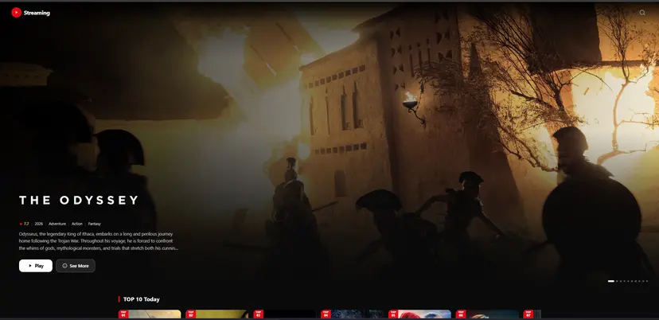
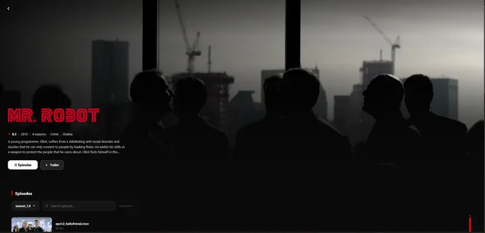

# Streaming App

A self-hosted web application for discovering movies and TV shows and playing
them through a user-configured streaming source. Streaming App combines a
cinematic React interface with a small Express API and is designed for personal
deployments on home servers and low-power devices such as a Raspberry Pi.

## Overview

Streaming App uses [The Movie Database (TMDB)](https://www.themoviedb.org/) for
search, artwork, cast information, trailers, episodes, collections, and
recommendations. Playback is provider-agnostic: the backend creates embed URLs
from the `STREAM_SOURCE` configured by the person hosting the application.

The project is split into two TypeScript applications. The Vite frontend
provides the browsing and playback experience, while the Express backend keeps
the TMDB API key private, validates requests, normalizes TMDB responses, and
resolves stream URLs.

## Preview

### Home page



### Details page



## Features

- Movie and TV discovery powered by TMDB
- Auto-cycling hero slideshow with backdrop artwork and title logos
- Top 10, trending, top-rated, and genre-based browsing sections
- Search overlay with movie and TV filters, debounced results, and recent
  searches stored locally in the browser
- Detailed title pages with ratings, runtime, genres, overview, cast, trailers,
  recommendations, and related movie collections
- TV season selector and episode browser
- Cross-season episode search with cached season data
- Actor pages with biography, known-for titles, movies, and TV credits
- Full-screen iframe player for movies and individual TV episodes
- Responsive React and Tailwind CSS interface
- Validated Express API with structured error responses, security headers, and
  development request logging
- Provider-neutral playback integration configured entirely through an
  environment variable

## Tech stack

| Area | Technologies |
| --- | --- |
| Frontend | React 19, TypeScript, Vite, React Router, Tailwind CSS, Axios |
| Backend | Node.js, Express 5, TypeScript, Axios, Joi, Helmet, Winston |
| Metadata | TMDB API |
| Playback | User-configured embed provider |

## Project structure

```text
streaming-app/
├── backend/               # Express API and external service integrations
│   ├── src/core/          # Middleware, logging, validation, and error handling
│   ├── src/rest/          # Health, TMDB, and stream routes
│   ├── src/service/       # TMDB client and stream URL generation
│   └── src/validation/    # Joi request schemas
├── frontend/              # React single-page application
│   ├── public/            # Static assets
│   └── src/
│       ├── api/           # Backend API clients
│       ├── components/    # Layout, cards, rows, and UI controls
│       ├── hooks/         # Data fetching and UI behavior
│       └── pages/         # Home, title, actor, and player pages
├── readme_images/         # Screenshots used in this README
├── LICENSE
└── README.md
```

## Prerequisites

- A current Node.js installation with npm
- A [TMDB API key](https://www.themoviedb.org/settings/api)
- A streaming source that supports the embed URL format described below

## Setup

Clone the repository, then install the frontend and backend dependencies:

```bash
cd backend
npm install

cd ../frontend
npm install
```

Create the local environment files from the included examples:

```bash
cp backend/.env.example backend/.env
cp frontend/.env.example frontend/.env
```

On Windows PowerShell, use:

```powershell
Copy-Item backend/.env.example backend/.env
Copy-Item frontend/.env.example frontend/.env
```

Configure the backend in `backend/.env`:

```env
NODE_ENV=development
PORT=3000
TMDB_API_KEY=YOUR_TMDB_API_KEY
STREAM_SOURCE=https://your-stream-provider.example
```

Configure the frontend in `frontend/.env`. Its backend port must match the
backend `PORT` value:

```env
BACKEND_PORT=3000
```

Start both applications in separate terminals:

```bash
# Terminal 1
cd backend
npm run dev
```

```bash
# Terminal 2
cd frontend
npm run dev
```

Open the local URL printed by Vite. During development, Vite proxies requests
from `/api` to `http://localhost:${BACKEND_PORT}`, so no browser-exposed TMDB
key or separate CORS configuration is required.

## Environment variables

### Backend

| Variable | Required | Description |
| --- | --- | --- |
| `NODE_ENV` | No | Set to `development` to enable HTTP request logging |
| `PORT` | Yes | Port on which the Express API listens |
| `TMDB_API_KEY` | Yes | Server-side TMDB API key used for metadata requests |
| `STREAM_SOURCE` | Yes | Base URL of the host-provided streaming embed service |

### Frontend

| Variable | Required | Description |
| --- | --- | --- |
| `BACKEND_PORT` | Yes for local development | Backend port used by the Vite `/api` development proxy |

Environment files are excluded from Git. Keep the TMDB API key and any private
provider details in `backend/.env`; do not place secrets in frontend variables,
because Vite variables may be included in the browser bundle.

## Streaming source integration

`STREAM_SOURCE` must be an absolute base URL. A trailing slash is optional and
is removed automatically. The configured service is expected to support these
embed paths:

```text
/embed/movie/{tmdbId}
/embed/tv/{tmdbId}/{season}/{episode}
```

For example, a movie with TMDB ID `550` resolves to:

```text
https://your-stream-provider.example/embed/movie/550
```

The generated URL is loaded inside an iframe. The provider must therefore
permit framing from the domain where the frontend is hosted. Streaming App does
not download, proxy, store, or bundle video files.

## Available scripts

Run these commands from the package they belong to.

### Frontend

| Command | Description |
| --- | --- |
| `npm run dev` | Start the Vite development server |
| `npm run build` | Type-check the frontend and create a production build |
| `npm run lint` | Run ESLint across the frontend |
| `npm run preview` | Preview the production build locally |
| `npm run serve` | Serve the built `dist` directory on port `1111` when the `serve` CLI is available |

### Backend

| Command | Description |
| --- | --- |
| `npm run dev` | Start the API with automatic restarts |
| `npm run build` | Compile TypeScript into `dist` |
| `npm start` | Run the compiled backend from `dist/index.js` |

## API overview

All application endpoints are served below `/api`.

| Method | Endpoint | Description |
| --- | --- | --- |
| `GET` | `/api/health/ping` | Check whether the backend is responding |
| `GET` | `/api/tmdb/search?q={query}&type={type}` | Search movies, TV shows, or both |
| `GET` | `/api/tmdb/trending?type={type}&window={window}` | Get daily or weekly trending titles |
| `GET` | `/api/tmdb/movie/{tmdbId}` | Get movie details, credits, and videos |
| `GET` | `/api/tmdb/tv/{tmdbId}` | Get TV details, credits, and videos |
| `GET` | `/api/tmdb/tv/{tmdbId}/season/{season}` | Get a season and its episodes |
| `GET` | `/api/tmdb/tv/{tmdbId}/episodes` | Get episodes across every season |
| `GET` | `/api/tmdb/{type}/{tmdbId}/recommendations` | Get related titles |
| `GET` | `/api/tmdb/{type}/{tmdbId}/images` | Get preferred title logo artwork |
| `GET` | `/api/tmdb/collection/{tmdbId}` | Get a movie collection |
| `GET` | `/api/tmdb/top-rated/{type}` | Get top-rated movies or TV shows |
| `GET` | `/api/tmdb/genres/{type}` | List movie or TV genres |
| `GET` | `/api/tmdb/discover/{type}/{genreId}` | Discover titles by genre |
| `GET` | `/api/tmdb/person/{personId}` | Get person details and selected credits |
| `GET` | `/api/streams/movie/{tmdbId}` | Resolve a movie embed URL |
| `GET` | `/api/streams/tv/{tmdbId}/{season}/{episode}` | Resolve a TV episode embed URL |

`type` accepts `movie` or `tv` unless an endpoint states otherwise. Search also
accepts `multi`, trending accepts `all`, and the trending window accepts `day`
or `week`. IDs, seasons, and episode numbers must be positive integers. Invalid
requests return a `400` response with an `{ "error": "..." }` body.

## Production deployment

Build both packages:

```bash
cd backend
npm run build

cd ../frontend
npm run build
```

Run the compiled API with `npm start` from `backend`, and serve
`frontend/dist` with a static web server. Configure that server or a reverse
proxy so `/api/*` is forwarded to the backend and all other non-file routes
fall back to `frontend/dist/index.html` for React Router.

For a private deployment, place the application behind a firewall, VPN, or
authenticated reverse proxy. Use HTTPS when accessing it across a network and
only configure sources you are authorized to use.

## Content and privacy

- No movies, TV episodes, or other media are included in this repository.
- Streaming App does not host or upload media.
- Metadata and artwork are requested from TMDB.
- Recent search terms remain in the browser's local storage.
- Playback availability and behavior depend entirely on the configured source.

This product uses the TMDB API but is not endorsed or certified by TMDB.

## License

This project is licensed under the **MIT License**. See [LICENSE](LICENSE) for
details.
